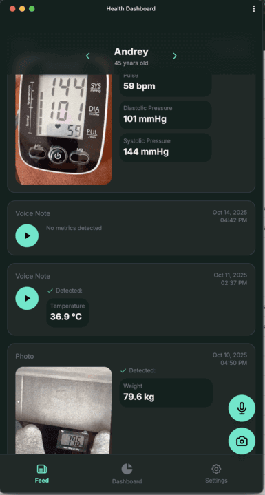
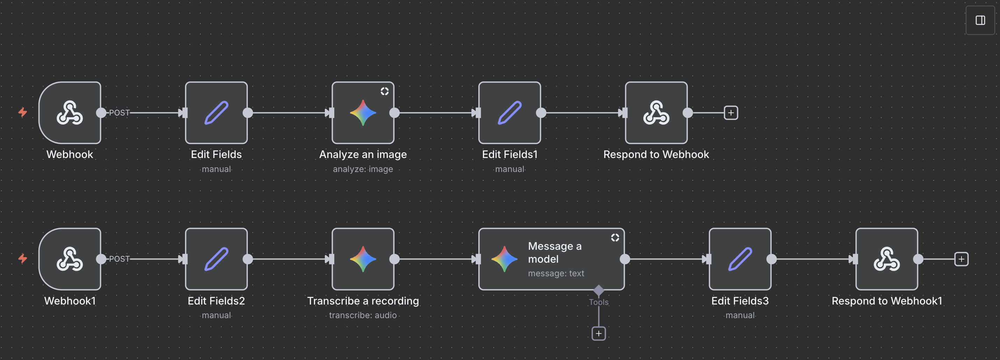

# Health Dashboard PWA

A simple Progressive Web App for tracking health metrics for the whole family. Monitor weight, blood pressure, pulse, temperature, and more through an intuitive mobile interface.

## Overview

This PWA allows every family member to easily log their health metrics by simply:
- Taking a photo of their measurement device (scale, blood pressure monitor, thermometer)
- Recording a voice note about their reading

The app automatically extracts the values and stores them in a timeline, making it easy to track health trends over time for each person.

## Features

- 👨‍👩‍👧‍👦 **Multi-User Support** - Track metrics for all family members
- 📸 **Photo Recognition** - Take a picture of your device, AI extracts the values
- 🎤 **Voice Input** - Record measurements verbally, AI processes the data
- 📊 **Multiple Metrics** - Weight, blood pressure, pulse, temperature
- 📈 **Time-Series Charts** - Visualize trends over 1W/1M/1Y periods
- 📱 **Mobile First** - Optimized for smartphones, works like a native app
- 🔌 **Offline Support** - Full PWA with service worker for offline usage
- 🌙 **Dark Mode** - Eye-friendly dark theme

## AI Processing

Voice recordings and photos are processed using a simple n8n workflow that leverages Google's Gemini 2.5 model to extract health metrics from images and audio transcriptions.

The workflow:
1. Receives webhook with photo or audio from the app
2. Processes the media through Gemini 2.5 for data extraction
3. Returns structured health metrics (weight, blood pressure, pulse, temperature)
4. App stores the data in the timeline for the respective family member

## Tech Stack

- **React 18** + **TypeScript** - Modern UI framework
- **Vite** - Fast build tool and dev server
- **Tailwind CSS v4** - Utility-first styling
- **vite-plugin-pwa** - PWA support with service worker
- **Recharts** - Data visualization
- **n8n** + **Gemini 2.5** - AI-powered metric extraction from photos and voice
